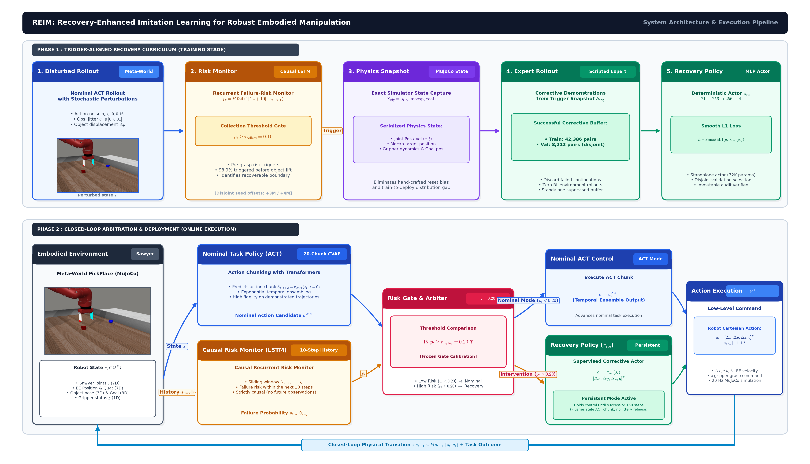
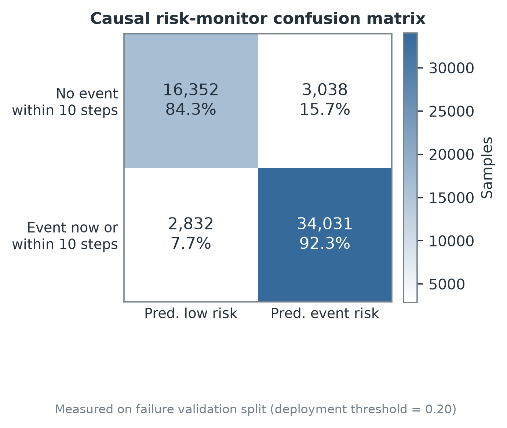
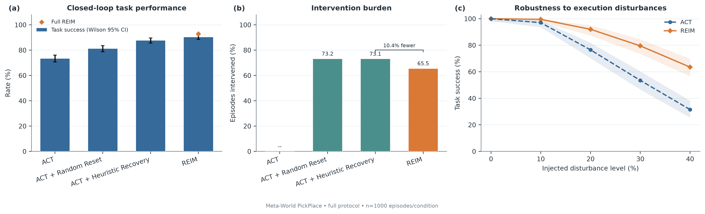
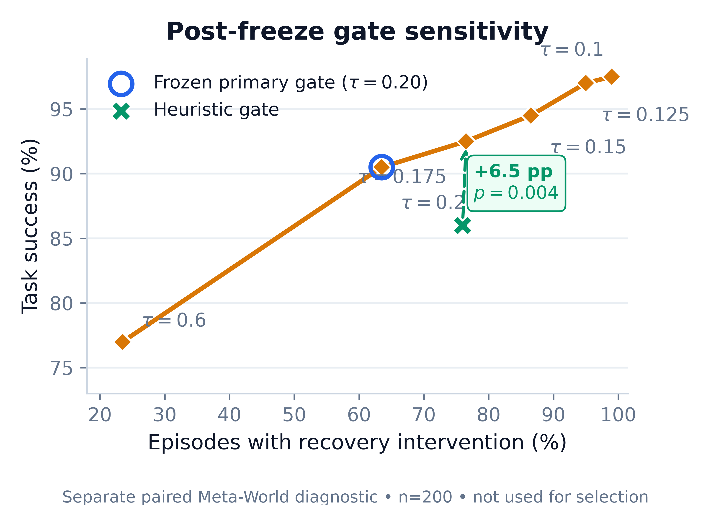
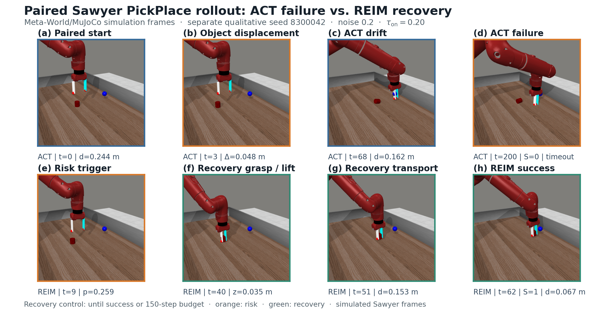

# REIM 项目技术精讲

**Recovery-Enhanced Imitation Learning for Robust Embodied Robot Manipulation**  
生成日期：2026-08-04  
适用场景：项目答辩、组会汇报、论文方法讲解、代码交接与复现实验

---

## 0. 先用一分钟讲清楚 REIM

REIM 解决的是 Meta-World PickPlace 任务中的一个具体问题：一个只在专家示范分布上学习的机器人策略，在实际闭环执行时一旦受到动作误差、观测误差或物体位移，后续观测就会偏离训练分布，原策略可能继续执行已经失效的动作序列，最终抓取失败、轨迹漂移或超时。

当前项目不是把所有能力塞进一个大网络，而是把控制责任拆成三个明确角色：

1. **状态版 ACT（Action Chunking with Transformers）**负责正常的抓取、搬运和放置。
2. **因果 LSTM 风险监测器**只读取最近 10 个已发生状态，估计近期进入失败事件的风险。
3. **触发对齐的恢复模仿策略**在风险超过阈值时接管控制，尝试从真实触发分布中的状态继续完成任务。

其部署闭环可以概括为：

```text
当前机器人状态
   ├──> ACT ───────────────────────────> 常规动作
   └──> 最近10步状态 ─> LSTM风险概率 ─┐
                                      ├─> 风险低：执行ACT动作
                                      └─> 风险高：恢复策略接管
                                                   │
                                                   └─> 成功或150步预算结束
```

核心结果是在相同的 1,000 个冻结 Meta-World 扰动任务上，ACT 成功率为 **73.4%**，完整 REIM 为 **90.4%**，配对提升 **17.0 个百分点**；170 个 ACT 失败任务被救回，0 个 ACT 原本成功任务被损害。

> **必须保持的科研口径**：当前正式恢复器是监督式 trigger-aligned recovery imitation actor，不是强化学习策略；实验是 Meta-World/MuJoCo 中的模拟 Sawyer，不是实体机器人；约 99% 的恢复触发位于首次抬升之前，因此当前证据主要支持“早期风险纠偏与任务恢复”，不能外推为任意掉落后的通用修复。



---

## 1. 项目到底解决什么任务

### 1.1 Benchmark 与机器人

- Benchmark：Meta-World MT1。
- 用户指定的历史任务名：`PickPlace-v2`。
- 当前 Meta-World 3.1.1 中实际执行的维护版本：`pick-place-v3`。
- 机器人：MuJoCo 中的 Sawyer 7 自由度机械臂。
- 任务过程：接近物体、闭合夹爪、抬升物体、搬运到目标区域并放置。
- 单个 episode 最大长度：200 步。
- 环境成功信号：Meta-World 任务成功标志；语义距离阈值配置为 0.07 m。

`PickPlace-v2` 到 `pick-place-v3` 是 API 维护版本映射，不代表项目更换了任务。代码会同时记录 requested task 和实际运行的环境标识，避免把不存在的旧注册名写成已直接执行。

### 1.2 状态与动作

默认策略输入是一个 21 维语义状态：

| 区间 | 维数 | 内容 |
|---|---:|---|
| `s[0:7]` | 7 | Sawyer 关节位置 `qpos` |
| `s[7:10]` | 3 | 末端执行器位置 XYZ |
| `s[10:14]` | 4 | 末端执行器四元数 WXYZ |
| `s[14:17]` | 3 | 被操作物体位置 XYZ |
| `s[17:20]` | 3 | 目标位置 XYZ |
| `s[20]` | 1 | 夹爪开合状态 |

因此

\[
s_t\in\mathbb{R}^{21}.
\]

动作是四维连续控制量：

\[
a_t=[\Delta x_t,\Delta y_t,\Delta z_t,g_t]\in[-1,1]^4,
\]

前三维控制 TCP 的笛卡尔增量，最后一维控制夹爪。

环境也提供 Meta-World 原始 39 维观测模式，但当前正式模型和论文结果使用 21 维语义状态。这意味着项目研究的是**状态观测下的鲁棒控制**，而不是视觉端到端操作。

### 1.3 扰动模型

项目向闭环执行注入三类扰动：

1. **动作噪声**：在 ACT 或恢复策略输出后叠加高斯噪声。
2. **观测噪声**：对送入策略与监测器的状态增加高斯误差。
3. **物体扰动**：在 episode 中对物体位置施加一次模拟位移。

主实验的 20% 扰动对应：

- 动作噪声标准差 0.08；
- 观测噪声标准差 0.005；
- 物体位移标准差 0.02 m。

鲁棒性实验把扰动等级扩展到 0%、10%、20%、30% 和 40%。所有方法在同一条件下消费同一批序列化任务状态和扰动日程，从而尽量把比较差异归因于控制器，而不是任务随机性。

---

## 2. 为什么只用 ACT 仍然会失败

模仿学习的训练目标通常是在专家分布上最小化动作误差：

\[
\min_\theta\;\mathbb{E}_{(s,a^E)\sim\mathcal D_E}
[\ell(\pi_\theta(s),a^E)].
\]

但部署时状态由策略自己的历史动作决定：

\[
s_{t+1}\sim P(\cdot\mid s_t,\pi_\theta(s_t)).
\]

一旦某一步动作有误，机器人将进入专家数据很少覆盖的新状态；新状态又可能产生更差动作，误差会沿时间累积。这就是闭环中的 covariate shift / compounding error。

ACT 比逐步 BC 更强，因为它一次预测一段动作并进行时间集成，能减少短视和抖动；但它仍然是一个**名义策略**：它主要学习成功示范的轨迹结构，没有天然机制判断“当前动作块已经不再适合现在的物体位置”。当物体突然移动时，之前预测的动作块可能继续把机械臂带向旧位置。

REIM 的设计出发点不是要求 ACT 覆盖所有失败，而是承认名义策略有明确工作域，并在风险增大时进行责任切换。

---

## 3. REIM 的一个故事：选择性恢复闭环

REIM 的核心不是三个互不相关的网络，而是一个围绕**何时切换控制权**构造的闭环：

1. ACT 给出正常任务动作。
2. LSTM 同时从历史状态判断轨迹是否正在进入失败事件。
3. 低风险时不干预，保留 ACT 的名义能力。
4. 高风险时启动恢复 option。
5. 恢复策略训练数据专门来自这种“真实会触发的状态”，减少训练状态和部署触发状态之间的错位。

这形成了两个重要的分布对齐：

- **检测器对齐**：用受到动作、观测和物体扰动的 ACT rollout 训练，而不是只用专家轨迹。
- **恢复器对齐**：从 ACT+LSTM 在线触发时刻保存完整 MuJoCo 状态，再由专家从该状态继续，训练数据直接覆盖恢复器真正接管的位置。

因此项目最有价值的思想可以写成：

> 不让恢复策略在任意人工构造状态上学习，而让它在部署门控实际访问的触发分布上学习；再用因果时序门控把名义控制和恢复控制组合成一个选择性闭环。

---

## 4. 模块一：状态版 ACT 名义策略

### 4.1 为什么选择 ACT

PickPlace 包含接近、抓取、抬升、搬运、放置等相互关联的连续阶段。单步 MLP 每次只拟合当前动作，容易产生局部抖动；ACT 直接预测未来动作块，更适合表达“先下探、再闭爪、再抬升”这样的短期动作结构。

当前 ACT 配置为：

| 参数 | 数值 |
|---|---:|
| 状态维数 | 21 |
| 动作维数 | 4 |
| 动作块长度 | 20 |
| Transformer 隐藏维数 | 256 |
| 注意力头数 | 8 |
| CVAE encoder 层数 | 3 |
| decoder 层数 | 4 |
| FFN 维数 | 1,024 |
| 潜变量维数 | 32 |
| Dropout | 0.1 |
| 参数量 | 6,627,908 |

### 4.2 训练时的 CVAE

对每个状态，数据加载器构造长度 20 的未来专家动作块

\[
A_t^E=[a_t^E,a_{t+1}^E,\ldots,a_{t+19}^E].
\]

轨迹尾部不足 20 步的位置使用 padding mask，不把填充值计入重建误差。CVAE posterior encoder 接收 `[CLS, 当前状态, 未来动作块]`，输出潜变量分布：

\[
q_\phi(z\mid s_t,A_t^E)=\mathcal N(\mu_\phi,\operatorname{diag}(\sigma_\phi^2)).
\]

Transformer decoder 使用状态 token、潜变量 token 和 20 个可学习 action query，预测完整动作块：

\[
\hat A_t=\pi_{\mathrm{ACT}}(s_t,z).
\]

训练损失为掩码后的 L1 重建加 KL 正则：

\[
\mathcal L_{\mathrm{ACT}}
=\mathcal L_{L1}(\hat A_t,A_t^E)
+\beta D_{KL}(q_\phi(z\mid s_t,A_t^E)\|\mathcal N(0,I)),
\]

其中 \(\beta=10\)。训练 200 epoch，batch size 256，学习率 \(10^{-4}\)，weight decay \(10^{-4}\)，使用 trajectory-grouped 的 90%/10% 划分，避免同一条轨迹的相邻状态同时进入训练和验证。

### 4.3 推理与时间集成

推理阶段没有未来专家动作，因此丢弃 posterior encoder，固定

\[
z=0.
\]

每一步都会预测一个新的 20 步动作块。对同一个执行时刻，多个历史动作块会给出重叠预测，代码使用指数权重组合：

\[
a_t=\frac{\sum_i \exp(-m i)\hat a_t^{(i)}}
{\sum_i \exp(-m i)},\qquad m=0.05.
\]

这减少了单个动作块造成的尖锐变化。每次从 ACT 切到恢复或从恢复返回 ACT 时，动作块历史都会被清空，防止未执行的旧轨迹建议继续污染后续动作。

实现中重叠提案按“最早生成 → 最新生成”排列，因此上式的 \(i=0\) 对应最早但仍有效的提案，它获得最大权重；这是一项需要在复现时保持一致的实现细节，而不是默认“最新提案权重最大”。

### 4.4 ACT 数据与训练结果

- 500 条 Meta-World scripted Sawyer expert 成功轨迹；
- 示范成功率 100%；
- 共 25,969 个 transition；
- 平均轨迹长度 51.938 步；
- 轨迹长度范围 44–62 步；
- 最佳验证 action L1 为 0.004013。

这个结果说明 ACT 能拟合名义技能，但验证动作误差小不等价于闭环扰动下成功率高，因此仍需端到端评测。

---

## 5. 模块二：因果 LSTM 风险监测器

### 5.1 失败数据如何生成

冻结 ACT 后执行 2,000 个扰动 episode，扰动配置为：动作噪声 0.15、观测噪声 0.01、物体位移概率 0.02、位移幅度 0.04 m。

数据统计：

- 2,000 个 episode；
- 285,443 个时序窗口；
- episode 成功率 39.65%；
- 1,511 个 episode 发生物体扰动；
- 正标签比例 64.09%。

### 5.2 在线失败事件定义

事件标签器仅使用当前和过去的测量，规则包括：

1. 环境显式报告物体掉落；
2. 物体或机械臂超出工作空间；
3. episode 超时或失败终止；
4. 机械臂曾靠近物体，但之后远离且未抬升，判为抓取失败；
5. 与物体发生交互后，物体到目标的距离长期没有至少 0.004 m 的变化；
6. 交互后相对初始目标距离产生超过 0.10 m 的错误偏离。

进度和偏离规则只在确认物体已经移动或抬升后启用，避免把正常的抓取前接近阶段误标为“没有进度”。

### 5.3 输入窗口与预测目标

在时刻 \(t\)，输入窗口严格结束于当前时刻：

\[
X_t=[s_{\max(0,t-9)},\ldots,s_t].
\]

早期不足 10 步的窗口右侧补零，并显式传入有效长度，LSTM 通过 `pack_padded_sequence` 忽略 padding。

监督目标是未来 10 步的 inclusive event target：

\[
y_t=\mathbf 1\{\exists j\in[t,t+10],\ e_j=1\}.
\]

注意目标可以查看未来事件，但输入绝不包含未来状态，因此不存在输入泄漏。由于区间包含 \(t\)，标准分类指标同时包含“事件已经发生”和“事件即将发生”的窗口，所以项目把该模型严谨地称为**因果风险监测器**，而不是纯粹的长时域预测器。

### 5.4 网络与训练

结构为：

```text
10 × 21 状态序列
        │
    LSTM hidden=128, layers=1
        │
    Linear 128→64 + ReLU + Dropout(0.1)
        │
    Linear 64→1
        │
      Sigmoid
```

使用带自动正样本权重的 `BCEWithLogitsLoss`：

\[
\mathcal L_{det}=-w_+y\log\sigma(l)-(1-y)\log(1-\sigma(l)).
\]

训练最多 50 epoch，batch size 512，学习率 \(5\times10^{-4}\)，trajectory-grouped 80%/20% 划分，按最低验证 BCE 选择 checkpoint。部署阈值冻结为 \(\tau_{on}=0.20\)。

### 5.5 如何理解检测指标

在阈值 0.20、56,253 个验证窗口上：

- Accuracy：89.6%；
- Precision：91.8%；
- Recall：92.3%；
- F1：92.1%；
- 混淆矩阵：TN=16,352，FP=3,038，FN=2,832，TP=34,031。

但 86.1% 的正窗口对应 offset=0，即事件在当前时刻已经发生。只保留严格未来事件后，precision/recall/F1 为 53.5%/68.3%/60.0%；在 trajectory 级别，191/258 条事件轨迹能在第一个事件之前告警，比例 74.0%，最新告警提前量中位数为 1 步。

这说明 LSTM 的主要价值是提供一个闭环风险信号，而不是证明它能提前很多步准确预测所有失败。是否真正有用必须由 REIM 端到端成功率和干预负担共同验证。



---

## 6. 模块三：触发对齐的恢复模仿策略

### 6.1 为什么不能随便采恢复数据

如果人为随机化状态后训练恢复器，训练分布可能和 LSTM 真正触发时的状态完全不同。REIM 使用以下闭环采集过程：

1. 在 20% 混合扰动下运行 ACT。
2. LSTM 风险达到较宽松的采集阈值 \(\tau_{collect}=0.10\) 时，保存完整 MuJoCo snapshot。
3. snapshot 包含 `qpos/qvel`、mocap、控制量、目标和任务 bookkeeping，能够精确恢复该动态状态。
4. 从同一 snapshot 继续运行 Meta-World scripted expert。
5. 只有最终成功的专家 continuation 才产生监督状态—动作对。
6. 训练 bank 与验证 bank 使用不相交的 episode seeds。

较低的采集阈值用于扩大可恢复状态覆盖；部署阈值 0.20 则用于控制实际干预负担。两者有意分开，不是调参错误。

### 6.2 数据规模

| 数据 | 尝试 episode | 触发 snapshot | 可用成功 continuation | 状态—动作对 |
|---|---:|---:|---:|---:|
| 训练 | 1,000 | 985 | 978 | 42,386 |
| 验证 | 200 | 193 | 192 | 8,212 |

训练和验证按照触发轨迹分组，不把同一 continuation 的相邻状态拆到两侧。

### 6.3 恢复 actor

部署策略是确定性 MLP：

```text
state 21
  → Linear 256 → tanh
  → Linear 256 → tanh
  → Linear 4
  → clip[-1,1]
```

参数量为 72,452。训练目标为 Smooth L1：

\[
\mathcal L_{rec}(\psi)=\frac{1}{|\mathcal D_{rec}|}
\sum_{(s,a^E)}\operatorname{SmoothL1}(\pi_{rec,\psi}(s),a^E).
\]

训练 40 epoch，batch size 512，学习率 \(10^{-3}\)，输入状态增加标准差 0.005 的高斯增强，按照 trajectory-disjoint 验证 Smooth L1 选择模型；最佳验证损失为 0.006391。

最终 `imitation_recovery.pt` 只包含 actor、归一化信息、动作边界和 provenance，不包含 critic、随机 log standard deviation、optimizer 或 rollout buffer。导出审计在 42,386 个训练状态、8,212 个验证状态和 10,000 个确定性随机支持状态上比较源 actor 与导出 actor，共 60,598 个状态，动作最大误差为 0。

### 6.4 为什么当前恢复器不是 RL

当前正式模型记录：

- 强化学习环境交互步数：0；
- policy-gradient update：0；
- critic：无；
- 优化目标：监督 Smooth L1。

因此正确称呼是“trigger-aligned supervised recovery imitation”。项目中保留的 Stable-Baselines3 兼容代码和旧容器不改变最终部署策略的算法属性。

---

## 7. 运行时控制权如何切换

### 7.1 两个控制模式

控制器可以视为状态机：

```text
NOMINAL_ACT
   │  p_t >= 0.20
   ▼
RECOVERY_ACTIVE
   ├── 任务成功 ─> episode结束
   └── 使用满150步且仍未成功 ─> 清空ACT动作块并返回NOMINAL_ACT
```

最终协议设置：

- 触发阈值 `failure_threshold = 0.20`；
- 恢复预算 `recovery_budget = 150`；
- 最小恢复步数 `recovery_min_steps = 150`；
- 风险清除步数 `recovery_clear_steps = 200`；
- 释放阈值 `recovery_exit_threshold = 0`。

由于 `min_steps == budget` 且 `clear_steps > budget`，恢复中途不会因为短暂的风险下降而提前退出。换言之，一旦恢复器接管，它会持续控制到任务成功或 150 步预算耗尽。

### 7.2 为什么采用持久接管

触发后只执行几步恢复动作再交还 ACT，可能出现两类问题：

1. LSTM 风险暂时下降，但机器人仍未回到 ACT 熟悉的状态；
2. ACT 内部仍保存切换前生成的动作块，重新接管后可能执行过期建议。

项目因此使用持久 option，并在所有 hand-off 处清空 ACT temporal ensemble。代价是误报时可能浪费较多步数，所以论文同时报告干预率和平均步数，而不只报告成功率。

### 7.3 简化伪代码

```python
state = env.reset()
history = []
mode = "ACT"

while not done:
    history.append(state)
    risk = detector(last_10(history))

    if mode == "ACT" and risk >= 0.20:
        mode = "RECOVERY"
        act.reset_temporal_ensemble()
        recovery_steps = 0

    if mode == "RECOVERY":
        action = recovery_actor(state)
        recovery_steps += 1
    else:
        action = act.temporal_ensemble_action(state)

    state, success, done = env.step(action)

    if success:
        break
    if mode == "RECOVERY" and recovery_steps >= 150:
        mode = "ACT"
        act.reset_temporal_ensemble()
```

---

## 8. Baseline 为什么这样设计

正式主表使用四种方法：

1. **ACT**：没有任何干预，回答“名义模仿策略本身能做到什么”。
2. **ACT + Random Reset**：检测到启发式失败事件后，重新开始一个 fresh task retry，回答“额外再试一次是否已经足够”。重试使用保留的确定性 offset seed，不与同一次恢复等价。
3. **ACT + Heuristic Recovery**：使用与 REIM 完全相同的恢复 actor，但由语义启发式触发，回答“只要有恢复器，随便一个门控是否就够了”。启发式需要模拟器级物体交互、目标距离和显式失败信息。
4. **REIM**：LSTM 门控 + 同一个恢复 actor，回答“学习的时序门控是否优于强语义规则”。

这种设计把主要论证拆成两层：

- ACT → Heuristic Recovery 的大幅提升主要说明恢复动作本身有效；
- Heuristic Recovery → REIM 的提升与更低干预率说明学习的时序仲裁有额外价值。

没有把“Detector only”放进论文主故事，因为检测到风险后如果只是停止或不提供有效动作，它不是一个完整控制方案，也不能回答恢复机制是否有效。

---

## 9. 评测协议为什么可信

### 9.1 Common Random Numbers

主实验不是让每种方法各自随机运行 1,000 次，而是预先冻结 1,000 个 CRN episode specification。每个 specification 包含：

- 任务身份；
- 初始 MuJoCo 状态；
- episode seed；
- 扰动发生时刻与数值；
- 对应 SHA256。

同一 episode index 下的所有方法面对同一初态和扰动，能够进行逐 episode 配对比较。

### 9.2 指标定义

任务成功率：

\[
\text{SuccessRate}=\frac{\#\text{task success}}{\#\text{episodes}}.
\]

REIM/启发式恢复的 intervention outcome：

\[
\text{RecoveryRate}=\frac{\#\text{task success while recovery active}}
{\#\text{recovery interventions}}.
\]

随机重置报告的是 post-reset completion / reset，分母和语义不同，因此表中明确标为重置结果而不是同一类恢复率。

成功率区间使用 Wilson 95% CI；比率和平均步数使用 episode bootstrap。方法差异使用配对 bootstrap；匹配门控审计对二元配对结果使用 exact two-sided McNemar/binomial test。

---

## 10. 实验结果应该怎样解释

### 10.1 主结果

主条件为 20% 混合扰动，每种方法 1,000 个相同 episode：

| 方法 | 任务成功率 | 95% CI | 干预结果 | 干预率 | 平均步数 |
|---|---:|---:|---:|---:|---:|
| ACT | 73.4% | [70.6, 76.0]% | — | — | 93.3 |
| ACT + Random Reset | 81.3% | [78.8, 83.6]% | 74.5% | 73.2% | 93.3 |
| ACT + Heuristic Recovery | 87.7% | [85.5, 89.6]% | 83.3% | 73.1% | 72.8 |
| **REIM** | **90.4%** | **[88.4, 92.1]%** | **85.3%** | **65.5%** | **69.3** |

配对结论：

- REIM 相比 ACT：+17.0 pp，95% CI `[+14.7,+19.3]` pp；
- 170 个 ACT 失败 episode 被 REIM 救回；
- 0 个 ACT 成功 episode 被 REIM 损害；
- 相比 Random Reset：+9.1 pp，CI `[+6.1,+12.1]` pp；
- 相比 Heuristic Recovery：+2.7 pp，CI `[+0.7,+4.8]` pp；
- REIM 比启发式门控少干预 76 个 episode，干预负担相对下降 10.4%。

最重要的不是“REIM 只比启发式高 2.7 个点”，而是完整的 Pareto 关系：**成功率更高，同时干预次数更少，平均完成步数也更低**。



### 10.2 鲁棒性

每个噪声等级使用 200 个配对 episode：

| 扰动等级 | ACT | REIM | 提升 |
|---:|---:|---:|---:|
| 0% | 100.0% | 100.0% | 0.0 pp |
| 10% | 97.0% | 99.5% | +2.5 pp |
| 20% | 76.5% | 92.0% | +15.5 pp |
| 30% | 53.5% | 79.5% | +26.0 pp |
| 40% | 31.5% | 63.5% | +32.0 pp |

随着扰动变强，ACT 的成功率快速下降，而 REIM 的相对收益扩大。这符合系统设计目标：无扰动时不需要恢复，两者都能完成；偏离名义分布越远，风险触发和恢复的价值越明显。

### 10.3 门控贡献

在独立的 200 episode post-freeze bank 上：

- 启发式门控：成功率 86.0%，干预率 76.0%；
- LSTM `τ=0.175`：成功率 92.5%，干预率 76.5%，相同干预负担下提升 +6.5 pp，`p=0.0044`；
- 冻结部署点 `τ=0.20`：成功率 90.5%，干预率 63.5%，相对启发式提升 +4.5 pp，`p=0.0490`。

`τ=0.175` 的分析不是重新选择主实验阈值，而是证明在近似相同干预负担下，LSTM 仍能选择更有价值的介入时机。



---

## 11. 一个真实仿真 episode 如何恢复

Figure 5 使用同一个初始任务和同一个物体位移扰动，seed 为 8,300,042：

1. `t=0`：ACT 与 REIM 从完全相同的状态开始；
2. `t=3`：物体发生 0.048 m 位移；
3. ACT 继续沿失效轨迹执行，到 `t=200` 超时失败；
4. REIM 在 `t=9` 监测到风险概率 0.259，超过阈值 0.20；
5. 恢复策略接管 53 步，重新抓取、抬升并搬运；
6. REIM 在 `t=62` 达到任务成功。

这是一条单独的定性轨迹，只用于解释机制，不用于估计平均成功率。图像是直接从 Meta-World/MuJoCo 渲染的 Sawyer RGB frame，不是实体照片，也不是生成式模型合成图。



---

## 12. 这个方案的创新点应怎样讲

不要把创新描述成“用了 ACT、LSTM 和 MLP”三个网络的简单堆叠。更准确的三层创新是：

### 12.1 触发分布对齐的恢复学习

恢复数据不是离线随机构造，而是由冻结 ACT+LSTM 在线运行产生；采集状态就是恢复器将来可能接管的状态。它把 recovery policy 的训练分布与 controller arbitration 的访问分布连接起来。

### 12.2 因果时序风险门控

门控只使用最近 10 个已发生状态，不依赖未来状态；它学习动作误差、物体位移和轨迹进展共同形成的时序风险，而不是只看单帧距离阈值。

### 12.3 带责任边界的闭环仲裁

ACT 负责名义技能，恢复 actor 负责高风险区域，状态机负责明确切换；hand-off 时清除 ACT 动作块，恢复 option 持续到任务成功或预算结束。创新位于**策略组合与分布对齐**，而非声称发明了 Transformer、LSTM 或 MLP。

如果用于 EI 会议摘要，可以概括为：

> REIM introduces a trigger-aligned corrective imitation pipeline and a causal temporal arbitration mechanism that selectively transfers control from a chunked nominal policy to a persistent recovery option under execution disturbances.

---

## 13. 当前证据边界与局限

### 13.1 单任务

目前只在 Meta-World PickPlace 上验证。结果证明的是该任务上的机制有效性，不证明跨任务普适性。

### 13.2 使用 privileged state

21 维输入包含精确关节、物体和目标位置；恢复数据采集还需要完整 MuJoCo snapshot。它适合受控仿真实验，但真实机器人需要视觉/力觉状态估计和安全的数据收集流程。

### 13.3 主要是早期纠偏

恢复起点审计显示训练触发的 98.9% 和验证触发的 99.0% 位于首次 lift 之前。因此当前系统主要纠正抓取前接近或物体扰动后的轨迹，不能声称已经解决任意 post-drop recovery。

### 13.4 监测器并非长时域预言器

标准 confusion matrix 中大量正样本是当前事件窗口；严格 pre-event F1 为 60.0%，提前量中位数为 1 步。检测模块需要依赖闭环结果而不是单独指标来证明价值。

### 13.5 单个训练模型栈

主表在一个训练好的 ACT、LSTM 和恢复 actor 上使用大量配对测试种子，充分估计执行随机性，但没有传播多次模型训练带来的不确定性。进一步投稿可以训练 3–5 组独立模型种子。

### 13.6 恢复成功定义

当前 recovery rate 是“恢复控制仍激活时任务完成”，不是“恢复到经过认证的安全集后交回 ACT”。持久 option 的效果很好，但还没有证明可验证的安全 hand-back。

---

## 14. 复现实验的完整流程

### 14.1 安装

```bash
cd REIM
./setup.sh
source .venv/bin/activate
```

### 14.2 从头运行

```bash
./run_all.sh --full
```

默认主流程依次执行：

1. 收集 500 条专家示范；
2. 训练状态版 ACT；
3. 生成 2,000 条扰动 rollout；
4. 训练因果 LSTM；
5. 采集训练/验证恢复触发 bank；
6. 训练并导出监督恢复 actor；
7. 生成冻结 CRN episode bank；
8. 运行四方法主比较；
9. 运行鲁棒性、消融和门控敏感性；
10. 生成图表、LaTeX 表格、论文 PDF 和审计 manifest。

### 14.3 复用已有训练结果

```bash
./run_all.sh --full --resume --skip-data --skip-training
```

### 14.4 核验

```bash
python -m pytest -q
python scripts/update_paper_results.py --check-only
python scripts/reproducibility_manifest.py
./compile_paper.sh
```

正式证据入口：

- `results/tables/baseline.csv`
- `results/tables/baseline_episodes.csv`
- `results/tables/robustness.csv`
- `results/tables/gate_matched_comparison.json`
- `results/run_manifest.json`
- `paper_assets/reim_results.pdf`

---

## 15. 代码地图

| 功能 | 主要文件 |
|---|---|
| Meta-World 环境、状态与扰动 | `env/metaworld_pickplace.py` |
| ACT 网络 | `models/bc_policy.py` |
| ACT 训练 | `trainers/train_bc.py` |
| 失败标签 | `data/failure_labels.py` |
| 失败数据生成 | `scripts/generate_failures.py` |
| LSTM 风险监测器 | `models/failure_detector.py` |
| LSTM 训练 | `trainers/train_detector.py` |
| 触发 snapshot/专家 continuation | `scripts/collect_recovery_starts.py` |
| 恢复 actor | `models/imitation_recovery_policy.py` |
| 恢复训练与导出 | `trainers/train_recovery.py`, `scripts/export_imitation_recovery.py` |
| 闭环状态机 | `evaluation/evaluate_reim.py` |
| 四方法比较 | `evaluation/baseline.py` |
| 冻结 episode bank | `evaluation/episode_bank.py`, `scripts/generate_episode_bank.py` |
| 鲁棒性与消融 | `experiments/robustness.py`, `experiments/ablation.py` |
| 论文图表 | `visualization/plot_results.py` |
| 一键流水线 | `run_all.sh` |

---

## 16. 答辩常见问题

### Q1：为什么不用一个统一策略从正常状态一直学到失败状态？

统一策略需要同时覆盖高密度的成功示范分布和稀疏、异质的失败分布，训练目标容易互相干扰。REIM 用门控保留 ACT 的名义能力，只在高风险区域调用专门的恢复 actor，数据需求和责任边界更清楚。

### Q2：为什么 LSTM 只看 10 步？

10 步足以覆盖短期接近、物体位移和进展停滞信号，同时保持检测延迟和模型规模较小。该长度由项目配置冻结，后续可作为超参数做系统消融。

### Q3：为什么恢复采集阈值是 0.10，部署是 0.20？

采集阶段希望覆盖更宽的可恢复状态，因此使用低阈值；部署阶段需要控制误触发和干预成本，因此使用更保守的阈值。训练数据覆盖应当宽于最终控制器的工作区域。

### Q4：恢复策略为什么不用失败标签作为额外输入？

恢复 actor 的训练分布本身已经由 LSTM 触发筛选，failure awareness 体现在 sampling distribution，而不是一个可能被模型忽略的二值 mode bit。部署时 actor 只需要当前 21 维状态。

### Q5：既然恢复 actor 来源中出现过 SB3 容器，为什么不是 PPO？

算法属性由实际优化和导出的模型决定。正式 actor 只有监督 Smooth L1 训练、0 环境训练步和 0 policy-gradient update；导出文件没有 critic/optimizer，因此必须称为监督模仿。

### Q6：90.4% 是否来自重新尝试多个随机任务？

不是。主表所有方法共享同一 1,000 个冻结初始状态和扰动 schedule。只有 Random Reset baseline 按定义获得一个明确标注的 fresh-task retry。

### Q7：为什么恢复率 85.3% 小于总成功率 90.4%？

总成功率包含没有触发恢复、由 ACT 直接完成的 episode。恢复率的分母仅是发生恢复干预的 655 个 episode，其中 559 个在恢复控制期间成功。

### Q8：这能否称为实体机器人实验？

不能。所有图片来自 Meta-World/MuJoCo 的模拟 Sawyer。实体 Sawyer 需要相机/力觉、状态估计、真实扰动和安全实验协议。

### Q9：最应该追加什么实验？

优先级依次是：多训练种子、专门的 post-grasp/drop curriculum、多个 Meta-World 任务、视觉状态估计、实体 Sawyer 小规模验证。

---

## 17. 最后一句话

REIM 的价值不在于把 ACT、LSTM 和 MLP 并列放在一张图里，而在于建立了一个可审计的选择性恢复机制：**用 ACT 学正常任务，用因果时序风险决定何时离开正常策略，再用真实触发状态上的专家 continuation 学会如何把任务救回来。**
